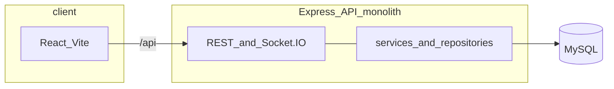

# Hire AI — Website tuyển dụng & chatbot tư vấn nghề nghiệp

## Đề tài

**Xây dựng website tuyển dụng tích hợp chatbot AI hỗ trợ tư vấn và định hướng nghề nghiệp.**

Hệ thống kết hợp đăng tin / ứng tuyển, quản trị nhà tuyển dụng & ứng viên, và **chatbot AI** (Gemini / OpenAI / Poe — cấu hình trên server) để hội thoại đa lượt, gợi ý nghề nghiệp và hỗ trợ hồ sơ. Monorepo: frontend React và **một API Express** (`server/`) — auth, jobs, candidates, AI, admin, realtime (Socket.IO) trong cùng process — kết nối MySQL; tầng nghiệp vụ trong `server/src/services/`.

## Công nghệ sử dụng

- **Frontend:** React.js, Tailwind CSS *(công cụ build/dev: [Vite](https://vitejs.dev/))*
- **Backend:** Node.js *(thư viện [Express.js](https://expressjs.com/))*
- **Database:** MySQL

## Architecture (overview)



**Production (gợi ý):** nginx (hoặc tương đương) phục vụ static `client/dist` và reverse proxy `/api`, `/socket.io`, `/uploads` tới process Node. Mẫu cấu hình: [`client/nginx/default.conf`](client/nginx/default.conf).

## Prerequisites

- Node.js 20+
- MySQL 8+ (hoặc instance tương thích)
- npm

## Environment

1. Copy [`.env.example`](.env.example) to `.env` and set secrets (`JWT_SECRET`, `DB_PASSWORD`, `AI_API_KEY`, …).
2. The repo allows committing `.env.example`; real `.env` files stay ignored.

## Install dependencies

```bash
npm run install:all
```

## Run locally

Start MySQL (or point `DB_*` in `.env` to your instance), run migrations/seeds from `server/` (`npm run db:migrate` / `npm run db:seed`), then:

```bash
npm run dev:server    # API — port 5000
npm run dev:client    # Vite — port 3000 (proxy /api → gateway)
```

- Frontend dev: `http://localhost:3000` (proxies `/api` to the gateway)
- API: `http://localhost:5000`

## Health and readiness

| Endpoint | Purpose |
|----------|---------|
| `GET /api/health` | Liveness-style: HTTP 200; `status` `ok` or `degraded` if DB ping fails; `database` `ok` \| `error`. |
| `GET /api/ready` | **Readiness**: HTTP 200 only if the gateway can ping MySQL; **503** otherwise (for load balancers / orchestration). |

Responses include header **`X-Request-Id`** (generated or forwarded from client) for log correlation.

## Scripts (repository root)

| Script | Description |
|--------|-------------|
| `npm run dev:client` | Vite dev server |
| `npm run dev:server` | Express API |
| `npm run verify:all` | Lint (no auto-fix) + all tests + client production build |

## Documentation

- Deployment, ports, env: [`docs/DEPLOYMENT.md`](docs/DEPLOYMENT.md)
- Hướng dẫn cho AI/agent: [`AGENTS.md`](AGENTS.md)

## License

ISC
